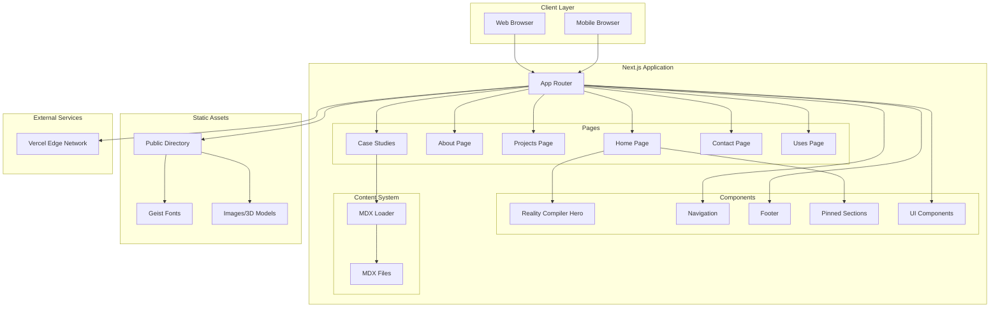
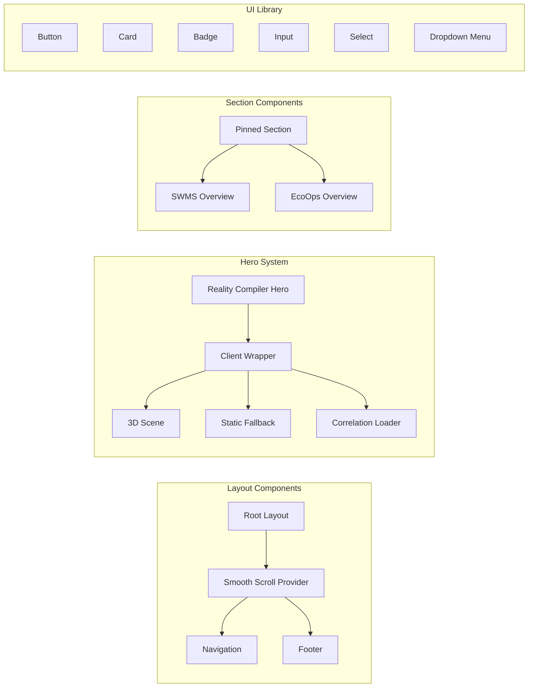
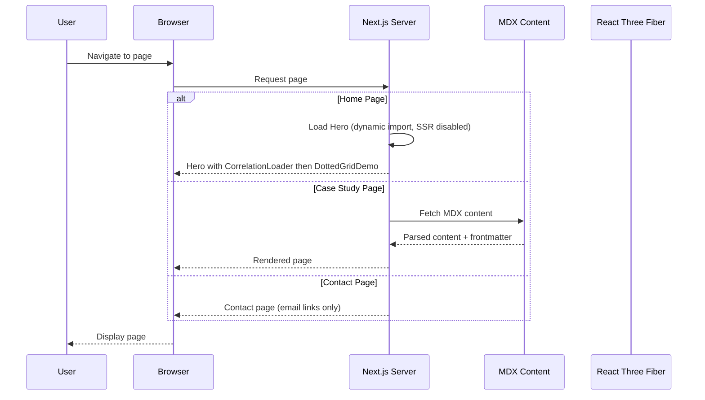
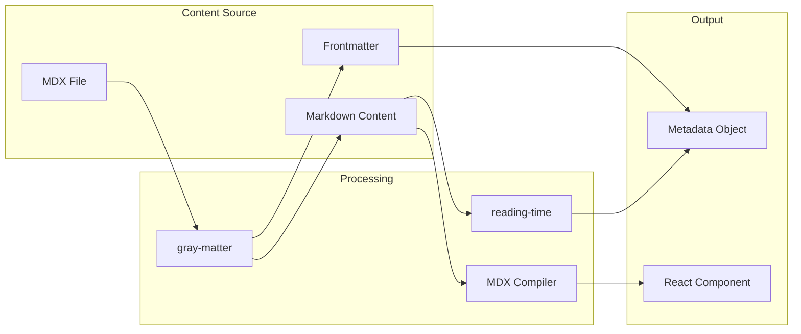
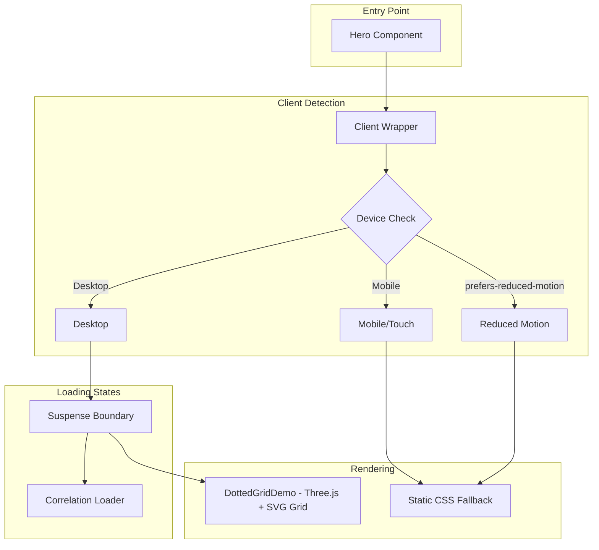
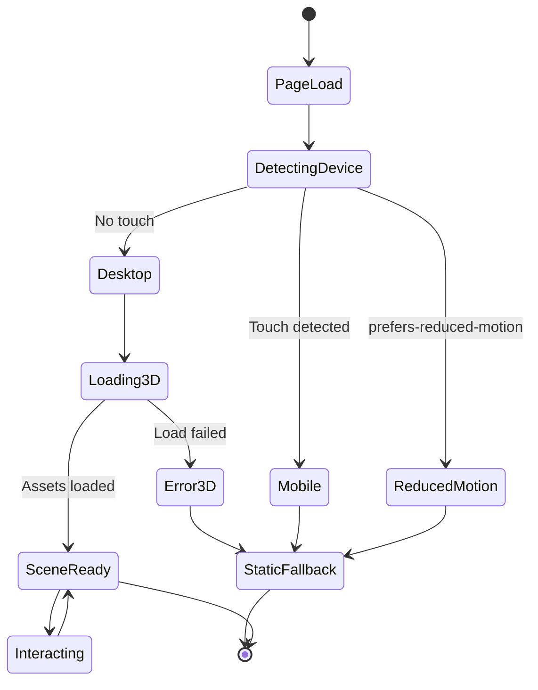
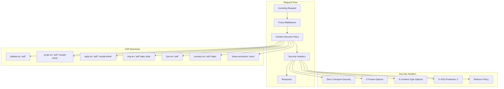
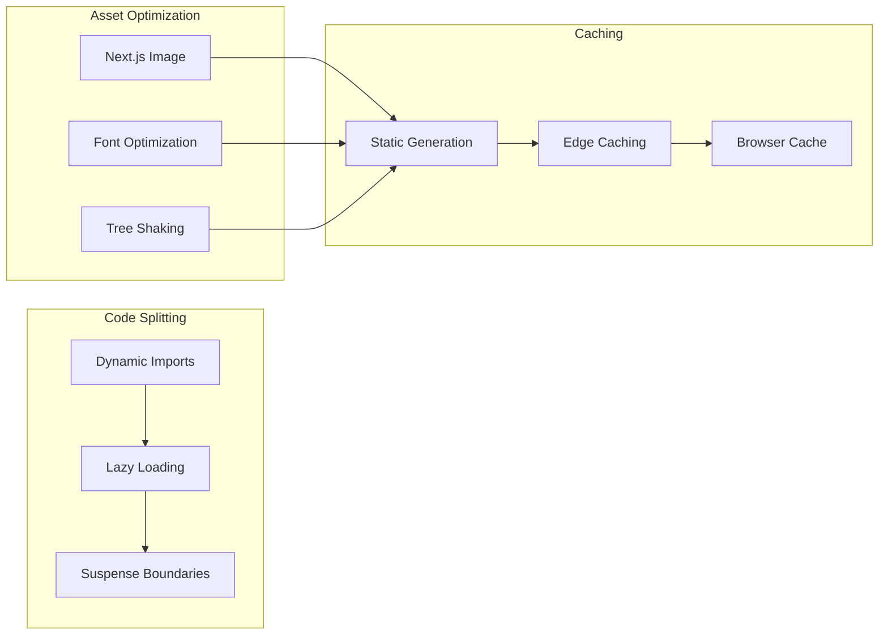
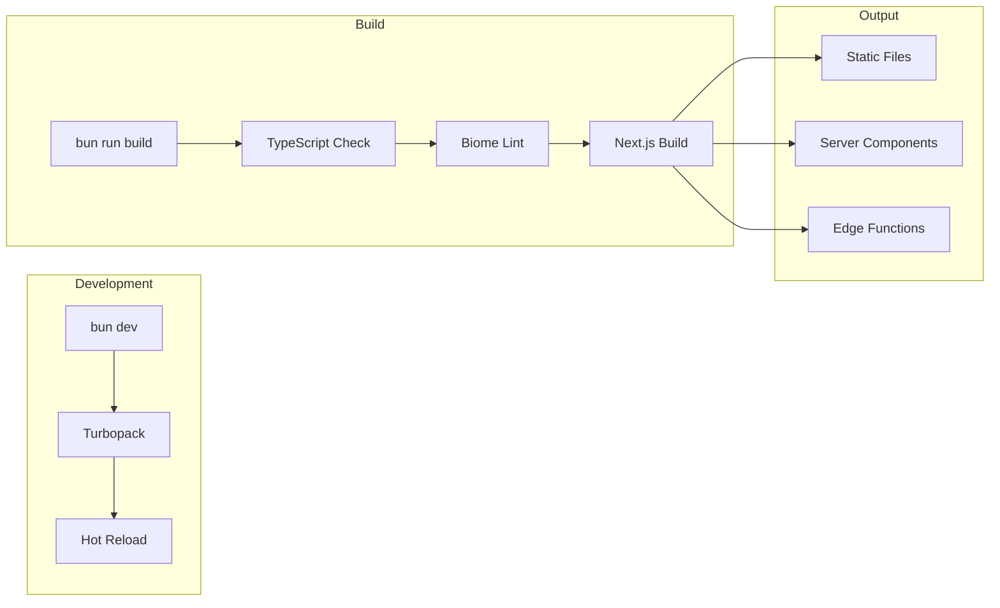

# System Architecture

This document provides a comprehensive overview of the D-VOID Portfolio system architecture.

## High-Level Architecture

## Component Architecture

## Data Flow

## MDX Content Pipeline

## 3D Hero System Architecture

## State Management

## File System Structure

```mermaid
graph TB
    subgraph "Project Root"
        Root[dvoid/]
    end

    subgraph "Application"
        AppDir[app/]
        RoutesDir["(routes)/"]
        LayoutFile[layout.tsx]
        HomePage[page.tsx]
        GlobalCSS[globals.css]
        Sitemap[sitemap.ts]
    end

    subgraph "Components"
        CompDir[components/]
        HeroDir[hero/]
        LayoutDir[layout/]
        SectionsDir[sections/]
        UIDir[ui/]
        EcoOpsDir[ecoops/]
        DemoDir[demo/]
    end

    subgraph "Content"
        ContentDir[content/]
        CaseStudiesDir[case-studies/]
    end

    subgraph "Libraries"
        LibDir[lib/]
        MDXIndex[mdx/index.ts]
        Utils[utils.ts]
    end

    subgraph "Documentation"
        DocsDir[docs/]
        PlanningDir[.planning/]
    end

    subgraph "Config"
        PackageJSON[package.json]
        NextConfig[next.config.ts]
        TSConfig[tsconfig.json]
        BiomeJSON[biome.json]
    end

    Root --> AppDir
    Root --> CompDir
    Root --> ContentDir
    Root --> LibDir
    Root --> DocsDir
    Root --> PlanningDir

    AppDir --> RoutesDir
    AppDir --> LayoutFile
    AppDir --> HomePage
    AppDir --> GlobalCSS
    AppDir --> Sitemap

    RoutesDir --> AboutPage[about/]
    RoutesDir --> CaseStudiesPage[case-studies/]
    RoutesDir --> ContactPage[contact/]
    RoutesDir --> ProjectsPage[projects/]
    RoutesDir --> UsesPage[uses/]

    CompDir --> HeroDir
    CompDir --> LayoutDir
    CompDir --> SectionsDir
    CompDir --> UIDir
    CompDir --> EcoOpsDir
    CompDir --> DemoDir

    ContentDir --> CaseStudiesDir

    LibDir --> MDXIndex
    LibDir --> Utils

    Root --> PackageJSON
    Root --> NextConfig
    Root --> TSConfig
    Root --> BiomeJSON
```

## Security Architecture

## Performance Optimization Strategy

## Build Pipeline

